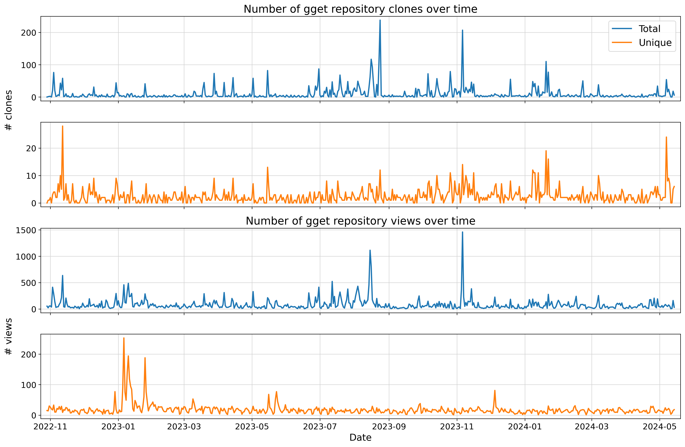
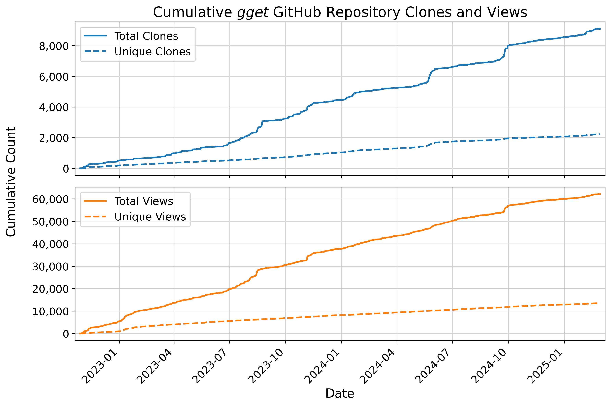

# gget traffic branch
This branch keeps track of gget repository traffic (views and clones) beyond the two week time period provided by Github using the following Github Actions workflow: https://github.com/marketplace/actions/repository-traffic

  

